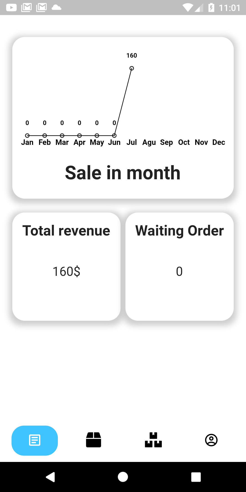

# GameStore - Hỗ trợ và quản lý bán game

GameStore cung cấp nền tảng hỗ trợ mua bán game trên các nền tảng PC, Android, ios,… Quản lý các đơn hàng cho người bán, 
thống kê báo cáo chung. Cung cấp giáo diện đơn giản cho khách hàng trong việc tiếp cận các sản phẩm được bán trên GameStore

## Nội dung
1. [Chức năng](#chức-năng)

   1. [Đăng nhập / Đăng kí](#đăng-nhập-/-đăng-kí)

   1. [Giao diện admin](#admin-ui)
   
   1. [Giao diện người dùng](#user-ui)
   
1. [Yêu cầu thiết bị](#yêu-cầu-thiết-bị)

1. [Thư viện và công nghệ](#thư-viện-và-công-nghệ)

1. [Tác giả](#tác-giả)

1. [Giấy phép](#giấy-phép)

## Chức năng
### Đăng nhập / Đăng kí
   * Welcome
	

   
   

   * Đăng nhập
   

   
   

  
   * Đăng kí
   
   

    
   

    
### admin ui
   * Tổng quan
	

    
   

  
   * Quản lý đơn hàng
  

    
   

   * Quản lý sản phẩm
   
   

   
   

    
### user ui
   * Màn hình chính
	

    
   

  
   * Thông tin giỏ hàng
     
   

    
   

   * Thông tin giỏ hàng
     
   

   
   

## Yêu cầu thiết bị
-Android:

   +Android studio : 3.0.1

   +Gradle : 4.1

   +Min sdk : 19

   +Target sdk : 26

-iOS:

   +iOS: 8.0

## Thư viện và công nghệ

- Language : Dart

- FrameWork : Flutter

- Database: FireBase

* flutter - https://github.com/flutter/flutter.git

## Tác giả
Trần Quang Tuấn - 19522482@gm.uit.edu.vn

Trần Hoàng Anh - 19521214@gm.uit.edu.vn

## Giấy phép

    Copyright 2021 yami

    Licensed under the Apache License, Version 2.0 (the "License");
    you may not use this file except in compliance with the License.
    You may obtain a copy of the License at

       http://www.apache.org/licenses/LICENSE-2.0

    Unless required by applicable law or agreed to in writing, software
    distributed under the License is distributed on an "AS IS" BASIS,
    WITHOUT WARRANTIES OR CONDITIONS OF ANY KIND, either express or implied.
    See the License for the specific language governing permissions and
    limitations under the License.
